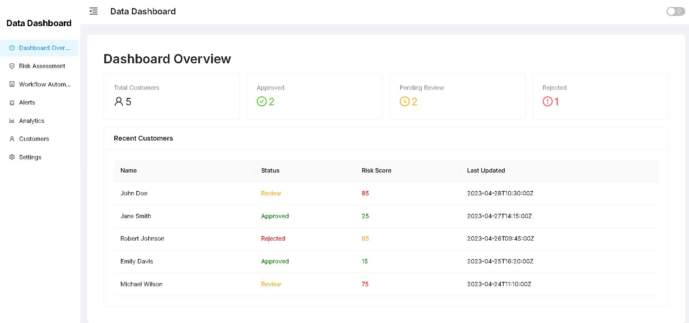
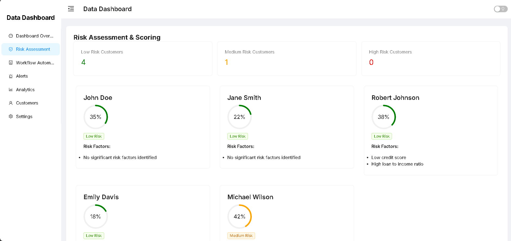
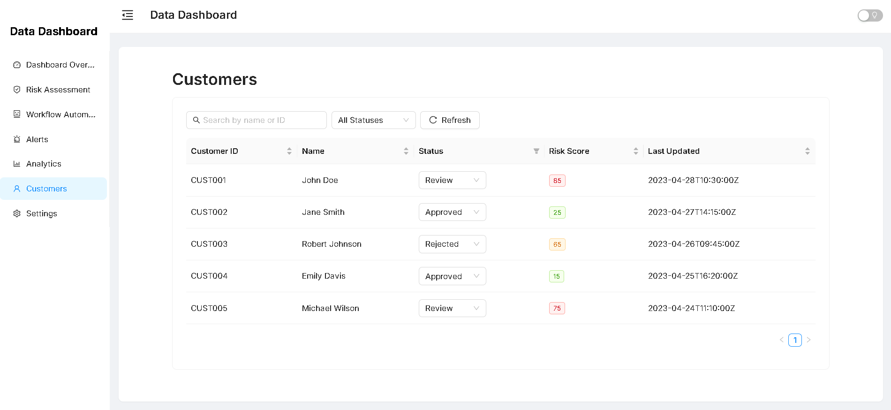
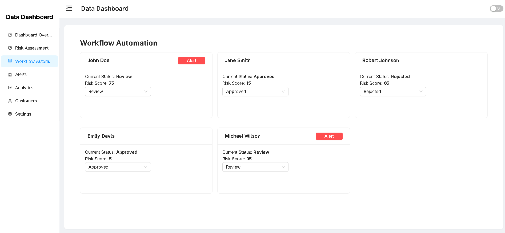
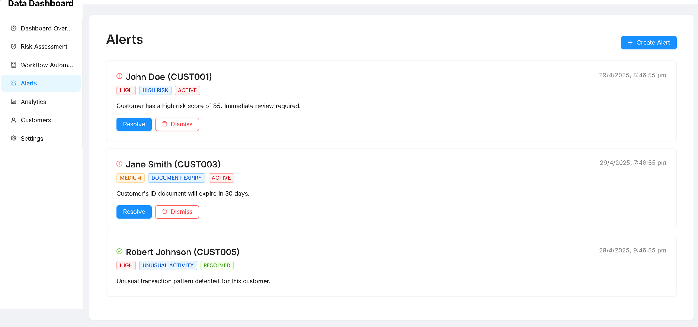

# Data Dashboard

A comprehensive dashboard application for managing customer data, risk assessment, and workflow automation.

## Setup Instructions

![Setup Instructions]

1. **Clone the repository:**
   ```bash
   git clone <your-repo-url>
   cd data-dashboard
   ```
2. **Install dependencies:**
   ```bash
   npm install
   # or
   yarn install
   ```
3. **Start the development server:**
   ```bash
   npm start
   # or
   yarn start
   ```
4. **Open your browser:**
   Navigate to `http://localhost:3000` to view the dashboard.

## Features

- **Dashboard Overview**: Visualize key metrics and customer data
- **Risk Assessment**: Evaluate customer risk scores based on financial data
- **Workflow Automation**: Manage customer statuses and create alerts
- **Customer Management**: View and update customer information
- **Alerts System**: Create and manage alerts for high-risk customers
- **Theme Support**: Toggle between light and dark modes

## Risk Scoring Explanation

![Risk Scoring]

The risk score is calculated based on the following factors:

1. **Credit Score (50% weight):** Higher credit scores result in lower risk scores.
2. **Loan Repayment History (30% weight):** Missed payments increase the risk score.
3. **Loan to Income Ratio (20% weight):** Higher ratios increase the risk score.

**Formula:**
```
riskScore = 100 - (creditScore / 850) * 50 - (missRate * 30) - (loanToIncomeRatio * 20)
```
Where:
- `missRate` is the ratio of missed payments to total payments
- `loanToIncomeRatio` is the ratio of outstanding loans to monthly income

**Risk Levels:**
- 0-40: Low Risk (Green)
- 41-70: Medium Risk (Orange)
- 71-100: High Risk (Red)

## AI Tool Usage Breakdown

![AI Tool Usage]

This project was developed with the assistance of several AI tools:

- **Cursor**: Used for code generation, refactoring, and bug fixing. For example, Cursor generated initial component structures, suggested responsive layout improvements, and provided code comments.
- **GitHub Copilot**: Used for code completion and suggestions, such as efficient data transformation functions and chart configuration.
- **ChatGPT**: Used for algorithm design and problem-solving, including the risk scoring algorithm and UI/UX suggestions.

**AI Usage Example:**

> See screenshots in the `/screenshots` folder for examples of AI-assisted code and UI.

You can also refer to the video walkthrough for a detailed explanation of how AI tools were used throughout the project.

## UI Design Screenshot


Below is a screenshot of the main dashboard UI:



## Screenshots

All screenshots referenced below are available in the `/screenshots` directory.

- **Dashboard Overview:**
  
- **Risk Assessment:**
  
- **Customer Management:**
  
- **Workflow Automation:**
  
- **Alerts System:**
  

## Data Storage

This application uses localStorage to persist data between sessions. The following data is stored:

- Customer information
- Customer status updates
- Alerts for high-risk customers

## Technologies Used

- React
- TypeScript
- Ant Design
- Recharts (for data visualization)

## Project Structure

```
project-root/
├── screenshots/                # Project screenshots for documentation
│   ├── dashboardOverview.png
│   ├── risk-assessment.png
│   ├── customer-listing.png
│   ├── workflow-automation.png
│   └── alert-system.png
├── src/
│   ├── components/             # React components
│   │   ├── Dashboard/          # Dashboard-related components (Overview, Customers, Alerts, Analytics, Settings, etc.)
│   │   ├── CustomerRiskCard.tsx
│   │   ├── RiskAssesment.tsx
│   │   └── WorkflowAutomation.tsx
│   ├── services/               # API and data services
│   │   └── api.ts
│   ├── types/                  # TypeScript interfaces and types
│   │   └── customer.ts
│   ├── utils/                  # Utility functions
│   │   ├── riskScoreCalculator.ts
│   │   └── localCustomerStorage.ts
│   ├── App.tsx                 # Main application component
│   └── index.js                # Application entry point
├── README.md                   # Project documentation
└── ...                         # Other configuration and project files
```

## License

This project is proprietary and confidential. Unauthorized copying, distribution, or use is strictly prohibited.

## Acknowledgments

- Ant Design for the UI components
- Recharts for the charting library
- The KYC Hub team for the project requirements